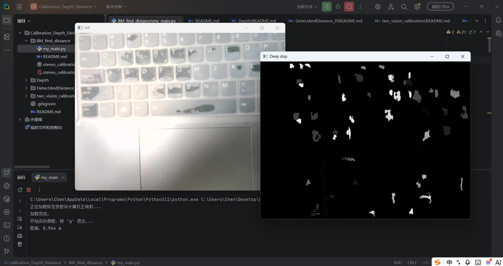

# BM_find_distance 
# 生成深度图，并用鼠标点击的方式返回该点的深度

### 使用方法
- 1.确认已经进行好标定，并将标定得到的参数写入文件**stereo_calibration_result.yml**,复制到当前目录下
- 2.连接相机
- 3.运行``python3 my_main.py``

### 效果图

  

### 测距注意：
由于噪声和手动点击会有抖动，所以鼠标回调方式的测距容易跳变。如果要做严谨的测距实验建议选择 **DetectAndDistance_2**