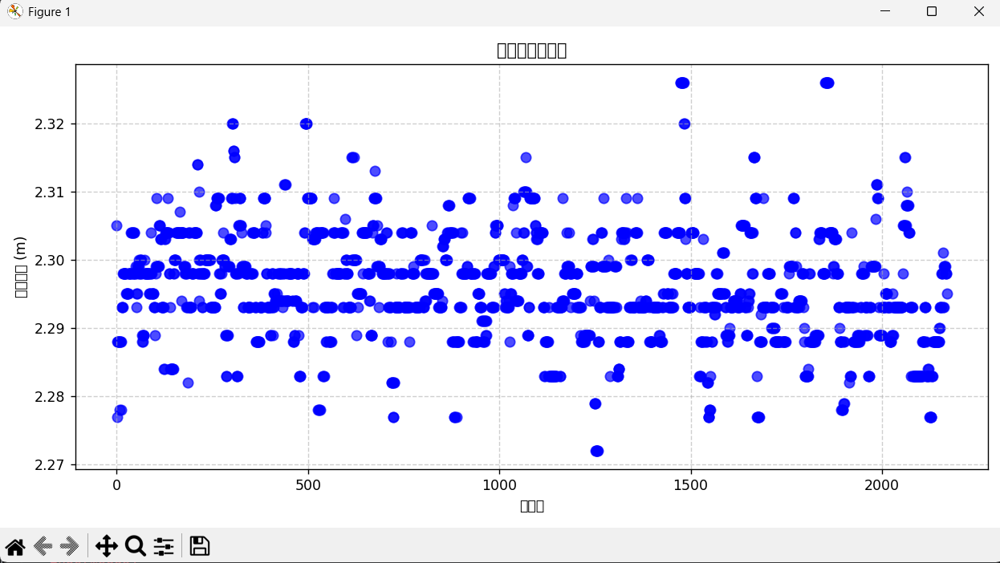

# DetectAndDistance_2

### 只能静态测距并用于快速验证相机标定参数（不需要像卡尔曼滤波一样调参），对于我们来说它还验证了姿态解算算法的正确，
### 但是它不适合高速状态下的测距（原因见最底下）

### 使用方法
- 1.确认已经进行好标定，并将标定得到的参数写入文件**stereo_calib.yml**,复制到当前目录下
- 2.连接相机
- 3.运行``python3 main.py``
- 4.运行``python3 draw.py``,它会根据写入result.txt的所有数据绘制散点图

### 注意测距时
- 1.不要选大块的纯色物体，否则容易跳变
- 2.可以调整颜色明暗阈值
- 3.可以增大面积阈值
- 4.可以调整滤波队列大小

### 效果图(以实际距离为2.35m时的测试数据为例)

  

### 问题 2026.5.18发现
滤波具体实现见 **[版本说明.txt](版本说明)**，
我们设想一个情景：
在无人机上以比较快的速度移动，然后在某一刻检测到物体，但是如果检测不稳定，比如由于震荡等造成了模糊，但无人机仍然在行进，这会导致两次测得的距离突变，然后队列又因为相差太大而直接丢弃数据，结果就是让数据一直卡在之前的距离中而无法更新新的距离。

对于这个问题，我们到时测距的时候会采取更加鲁棒的**一维卡尔曼滤波**
